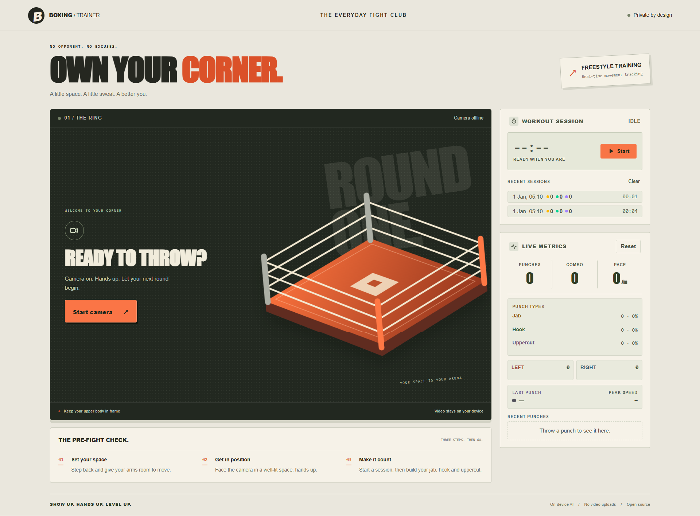

# AI Boxing Trainer

A real-time computer vision boxing coach powered entirely by local AI.

Runs 100% in the browser. No paid APIs. No cloud AI services. No backend.

Released under the [MIT License](LICENSE).

## Preview



## Stack

- React 19 + TypeScript (strict)
- Vite
- TailwindCSS v4
- MediaPipe Pose / MediaPipe Tasks Vision (pose landmarker lite, GPU with CPU fallback)
- HTML Canvas

## Features

- **Webcam capture** — browser-native camera streaming with status handling for denials and errors.
- **Pose detection** — MediaPipe pose landmarker run in-browser, with a mirrored skeleton overlay drawn on Canvas.
- **Punch recognition** — windowed detection engine that classifies jabs, hooks, and uppercuts from wrist/elbow kinematics, on a per-hand basis.
- **Workout sessions** — start/pause/resume/finish workouts with an elapsed timer, per-session stats, and locally persisted history.
- **Live metrics** — punch count, breakdown by hand and punch type, combo counter, peak/avg speed, and punch-per-minute pace.
- **Heads-up display** — in-frame punch callouts, combo badges, and speed readout overlaid on the video.
- **Impact effects** — punch-flash, expanding ring, and burst lines at the point of impact.
- **Performance monitoring** — throttled detection (30 fps) with a live FPS/detection-time readout.

## Getting started

```bash
npm install
npm run dev
```

Open the app in a browser and allow webcam access. For the best experience, stand at a distance where your full torso and both arms are visible.

## Scripts

| Command                | Description                                       |
| ---------------------- | ------------------------------------------------- |
| `npm run dev`          | Start the development server                      |
| `npm run build`        | Type-check and build for prod                     |
| `npm run lint`         | Lint with ESLint                                  |
| `npm run format`       | Format with Prettier                              |
| `npm run format:check` | Check formatting with Prettier                    |
| `npm run smoke`        | Run smoke tests for the punch and metrics engines |
| `npm run preview`      | Preview the production build                      |

## How detection works

The pose stream is processed at ~30 fps. For each arm, the detector tracks an extension baseline against the shoulder width, then opens a detection window when the wrist accelerates past a punch threshold. While the window is open, peak radial, lateral, and vertical velocities and the elbow angle are accumulated. When the wrist slows down (or the window times out), the classifier decides:

- **Jab** — extended (straight) elbow with dominant forward/radial extension.
- **Hook** — strongly lateral, horizontal punch with a bent elbow.
- **Uppercut** — strongly vertical rising punch with a bent elbow.

Classified punches are normalized to shoulder-widths-per-second and emitted as events with type, side, and speed.

## Privacy

Everything runs locally: camera frames never leave the device, no data is uploaded, and workout history is stored only in the browser's local storage.

## Architecture

Feature-based structure under `src/`:

```
src/
├── components/   # Presentational UI components
├── features/     # Feature modules (webcam, pose, punches, HUD, metrics, effects, workout)
├── hooks/        # Reusable React hooks
├── services/     # Reusable services (webcam, pose engine)
├── game/         # Game/render logic (detectors, engines)
├── types/        # Shared TypeScript types
└── utils/        # Pure helper utilities
```

Smoke tests live in `scripts/` and are run with `npm run smoke`.

## Development checklist

Run all checks before committing:

```bash
npm run smoke
npm run lint
npm run build
npm run format:check
```
